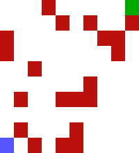

# Maze

A reinforcement learning maze implementation using Q-learning

## Description

The maze is composed by a grid filled with obstacles (red tiles). The Agent (blu tile) must reach the Exit (green tile).
The Agent can move up, down, left, right.

<kbd>

</kbd>

The shape of the maze can be chosen. The default shape of the maze is (10, 10).

The hyperparameters (alpha, gamma, epsilon, episodes) of the Q-learning algorithm can also be chosen.

Some instances of the maze cannot be solved (example: obstacles do not allow to reach the Exit) and others require different hyperparameters to work better.

## Algorithm

The Q-learning algorithm allows the Agent to use the environment's rewards to learn the best action to take in a given state.
It uses a Q-table, it's cardinality is (state space, action space).

The values stored in it are the Q-values. The Q-table maps each pair (state, action) to a Q-value. The Q-value represents the quality of an action taken from a state, better Q-values mean better chances of greater rewards.

## Reward function
The rewards given to the agent after the transition from state `s1` to state `s2` with action `a`:
- `-100`: if a wall collision occurred
- `-1`: for each step
- `+10000`: if the Agent reached the exit

## Execution

```bash
# activate Python env
user@host:~$ poetry shell

# show help message
(rl-py3.11) user@host:~$ python main.py --help

# call with default args
(rl-py3.11) user@host:~$ python main.py

# call with custom maze shape
(rl-py3.11) user@host:~$ python main.py --shape 20,20

# call with custom maze shape and hyperparameters
(rl-py3.11) user@host:~$ python main.py --alpha 0.5 --gamma 1.0 --epsilon 0.3 --episodes 10000 --shape 20,20
```

## References

Some really helpful resources that I used:

- https://www.learndatasci.com/tutorials/reinforcement-q-learning-scratch-python-openai-gym/
